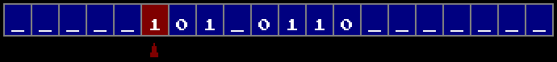

# Turing machine
Program to process and visualize Turing machine.

  
  

The project is built on [tPixelGameEngine](https://github.com/tucna/tPixelGameEngine) and [Dear ImGui](https://github.com/ocornut/imgui) for debug purposes. The debug window shows all delta functions.

# Controls

# Features

  
  

# Data input

# Screenshots

  
  &nbsp; &nbsp; &nbsp; &nbsp; 

